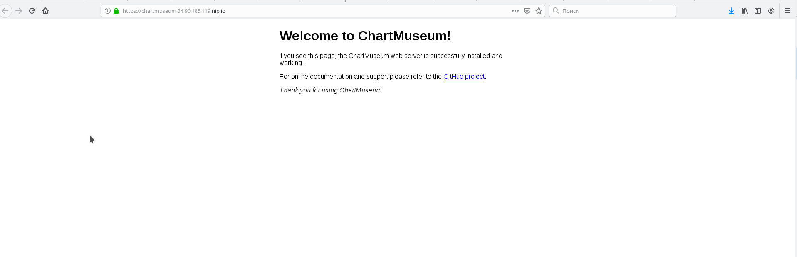
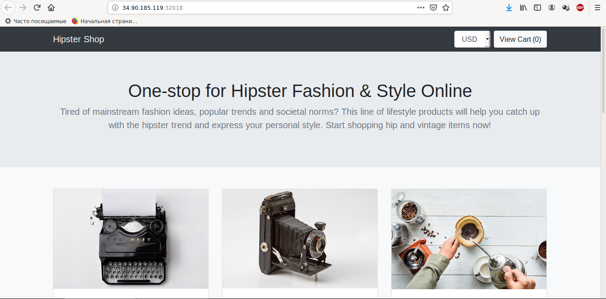
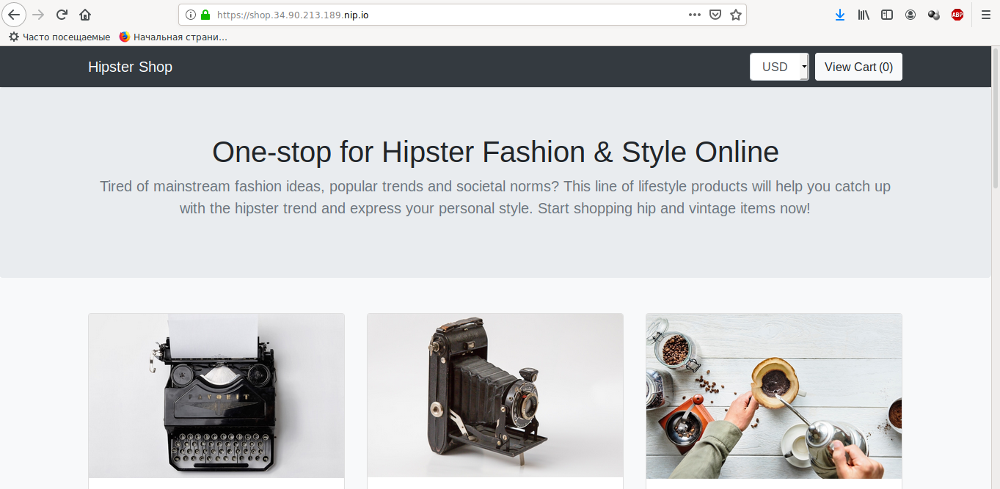

18 172,40 ₽ и 131 дн
# Домашнее задание 10 Helm
## 0. Установка Helm

### 0.0 Создание кластера
```
$ gcloud container clusters create "mycluster"
$ gcloud beta container clusters get-credentials
```        

### 0.1 Скачиваем helm
```
$ wget https://get.helm.sh/helm-v3.2.1-linux-amd64.tar.gz

$ tar -zxvf helm-v3.2.1-linux-amd64.tar.gz

$ sudo mv linux-amd64/helm /usr/local/bin/helm3

$ helm3 version
version.BuildInfo{Version:"v3.2.1", GitCommit:"fe51cd1e31e6a202cba7dead9552a6d418ded79a", GitTreeState:"clean", GoVersion:"go1.13.10"}
version.BuildInfo{Version:"v3.2.1", GitCommit:"fe51cd1e31e6a202cba7dead9552a6d418ded79a", GitTreeState:"clean", GoVersion:"go1.13.10"}
```

### 0.2 Добавим репозиторий stable
```
$ helm3 repo add stable https://kubernetes-charts.storage.googleapis.com

$ helm3 repo list
NAME    URL
stable  https://kubernetes-charts.storage.googleapis.com
```

## 1. Развернем 
### 1.1 Развернем nginx-ingress
```
$ kubectl create ns nginx-ingress
$ helm3 upgrade --install nginx-ingress stable/nginx-ingress --wait --namespace=nginx-ingress --version=1.11.1
```

### 1.2 Cert-manager

#### 1.2.1 Добавим репозиторий
```
$ helm3 repo add jetstack https://charts.jetstack.io
```

#### 1.2.2 Добавим CRD (https://github.com/jetstack/cert-manager/tree/master/deploy/charts/cert-manager)
```
$ kubectl apply -f https://raw.githubusercontent.com/jetstack/cert-manager/release-0.9/deploy/manifests/00-crds.yaml
```

#### 1.2.3 Label
```
$ kubectl create ns cert-manager
$ kubectl label namespace cert-manager certmanager.k8s.io/disable-validation="true" 
```

#### 1.2.4 Установим cert-manager
```
$ helm3 upgrade --install cert-manager jetstack/cert-manager --wait \
                    --namespace=cert-manager \
                    --version=0.9.0
```

#### 1.2.5 Проверим что запустилось
```
$ kubectl get pods --namespace cert-manager
NAME                                       READY   STATUS    RESTARTS   AGE
cert-manager-578c68747f-vnsmp              1/1     Running   0          3m38s
cert-manager-cainjector-7bc895df54-p66nk   1/1     Running   0          3m38s
cert-manager-webhook-5cf859b9b9-ph7rb      1/1     Running   0          3m38s
```

#### 1.2.6 Что не хватает
В документации описывают ClusterIssues и Issues. Создаем
```
$ kubectl apply -f cert-manager/01-clusterissues.yaml 
```

## 2. Chartmuseum
        
### 2.1 Узнаем External Ip nginx-ingress
```
$ kubectl get svc -A
NAMESPACE       NAME                            TYPE           CLUSTER-IP      EXTERNAL-IP     PORT(S)                      AGE
cert-manager    cert-manager-webhook            ClusterIP      10.47.242.255   <none>          443/TCP                      29m
default         kubernetes                      ClusterIP      10.47.240.1     <none>          443/TCP                      34m
kube-system     default-http-backend            NodePort       10.47.255.189   <none>          80:32453/TCP                 33m
kube-system     heapster                        ClusterIP      10.47.254.205   <none>          80/TCP                       33m
kube-system     kube-dns                        ClusterIP      10.47.240.10    <none>          53/UDP,53/TCP                33m
kube-system     metrics-server                  ClusterIP      10.47.247.57    <none>          443/TCP                      33m
nginx-ingress   nginx-ingress-controller        LoadBalancer   10.47.253.189   34.90.185.119   80:30366/TCP,443:31451/TCP   32m
nginx-ingress   nginx-ingress-default-backend   ClusterIP      10.47.242.122   <none>          80/TCP                       32m
```

наш ip - 34.90.185.119


### 2.2 Кастомизация установки chart museum
```
$ wget https://raw.githubusercontent.com/helm/charts/master/stable/chartmuseum/values.yaml
```

поправим оставим только ingress 
```
ingress:
  enabled: true
  annotations:
    kubernetes.io/ingress.class: nginx
    kubernetes.io/tls-acme: "true"
    certmanager.k8s.io/cluster-issuer: "letsencrypt-prod"
    certmanager.k8s.io/acme-challenge-type: http01
  hosts:
    - name: chartmuseum.34.90.185.119.nip.io
      path: /
      tls: true
      tlsSecret: chartmuseum.34.90.185.119.nip.io
env:
  open:
    DISABLE_API: false
```

### 2.3 Установим
```
$ kubectl create ns chartmuseum

$ helm3 upgrade --install chartmuseum stable/chartmuseum --wait \
                    --namespace=chartmuseum \
                    --version=2.3.2 \
                    -f chartmuseum/values.yaml
```

### 2.4 Проверяем
```
$ helm3 ls -n chartmuseum
NAME            NAMESPACE       REVISION        UPDATED                                 STATUS          CHART                   APP VERSION
chartmuseum     chartmuseum     1               2020-05-30 12:32:05.421747237 +0300 MSK deployed        chartmuseum-2.3.2       0.8.2
```


### 2.5 Заходим на сайт 
https://chartmuseum.34.90.185.119.nip.io (для вашего варианта нужно уточнить ip адрес)
Сайт должен иметь валидный сертификат


### 2.6 Научиться работать с chartmuseum 
Установка и удаление (заливка chart на chartmuseum)
            
#### 2.6.1 Добавить репозиторий
```                
$ helm3 repo add chartmuseum https://chartmuseum.34.90.185.119.nip.io
```

#### 2.6.2  Залить в chartmuseum
```
$ helm3 plugin install https://github.com/chartmuseum/helm-push
$ helm3 push mongodb/ chartmuseum
```

#### 2.6.3  Поищем пакет
```   
$ helm3 repo update
helm3 search repo mongodb
NAME                                    CHART VERSION   APP VERSION     DESCRIPTION
chartmuseum/mongodb                     7.8.10          4.2.4           DEPRECATED NoSQL document-oriented database tha...
stable/mongodb                          7.8.10          4.2.4           DEPRECATED NoSQL document-oriented database tha...
stable/mongodb-replicaset               3.15.1          3.6             NoSQL document-oriented database that stores JS...
stable/prometheus-mongodb-exporter      2.5.0           v0.10.0         A Prometheus exporter for MongoDB metrics
stable/unifi                            0.8.1           5.12.35         Ubiquiti Network's Unifi Controller
```
       
#### 2.6.4  Установим Mongodb из chartmuseum
```
$ kubectl create ns mongodb
$ helm3 upgrade --install mongo chartmuseum/mongodb --wait \
                    --namespace=mongodb
```

#### 2.6.5 Проверим поды
```
$ kubectl get pods -n mongodb
NAME                           READY   STATUS    RESTARTS   AGE
mongo-mongodb-c884c98f-qrxpv   1/1     Running   0          60s
```

## 3. Harbor
поправить value чтобы сервис был доступен с валидным сертификатом

### 3.1 Скачаем файл values c 
https://github.com/goharbor/harbor-helm
            
### 3.2 Поправим ingress в values
```
---
expose:
  type: ingress
  tls:
    enabled: true
    secretName: "harbor.34.90.185.119.nip.io"
  ingress:
    hosts:
      core: "harbor.34.90.185.119.nip.io"
    controller: default
    annotations:
      kubernetes.io/ingress.class: nginx
      kubernetes.io/tls-acme: "true"
      certmanager.k8s.io/cluster-issuer: "letsencrypt-prod"
      certmanager.k8s.io/acme-challenge-type: http01

notary:
  enabled: false
```

### 3.3 Добавим репозиторий
```
$ helm3 repo add harbor-demo https://helm.goharbor.io
$ helm3 repo update
```

### 3.4 Создадим Namespace
```
$ kubectl create namespace harbor
```

### 3.5 Установим
```
helm3 upgrade --install harbor harbor-demo/harbor --wait \
                    --namespace=harbor \
                    --version=1.1.2 \
                    -f harbor/values.yaml
```

### 3.6 Заходим на сайт
https://harbor.34.90.185.119.nip.io
login: admin
password: Harbor12345


## 4. Создаем свой helm chart

### 4.0 Создадим пустой chart
```            
$ helm3 create hipster-shop
```

### 4.1 Удаляем все с template и values.yaml
```
$ rm hipster-shop/values.yaml
$ rm -rf hipster-shop/templates/*
$ cd hipster-shop/templates
$ wget https://raw.githubusercontent.com/express42/otus-platform-snippets/master/Module-04/05-Templating/manifests/all-hipster-shop.yaml
```
   
#### 4.2 Попробуем установить
```
$ kubectl create ns hipster-shop
$ helm3 upgrade --install hipster-shop ./hipster-shop --namespace=hipster-shop
```

#### 4.3 Проверим - зайдем на сайт
```
$ kubectl get nodes -o wide
NAME                                       STATUS   ROLES    AGE   VERSION           INTERNAL-IP   EXTERNAL-IP     OS-IMAGE                             KERNEL-VERSION   CONTAINER-RUNTIME
gke-mycluster-default-pool-e5aa4ed5-12fp   Ready    <none>   28m   v1.14.10-gke.36   10.164.0.31   34.90.185.119   Container-Optimized OS from Google   4.14.138+        docker://18.9.7
gke-mycluster-default-pool-e5aa4ed5-7ncd   Ready    <none>   27m   v1.14.10-gke.36   10.164.0.33   34.90.177.203   Container-Optimized OS from Google   4.14.138+        docker://18.9.7
gke-mycluster-default-pool-e5aa4ed5-zctb   Ready    <none>   28m   v1.14.10-gke.36   10.164.0.32   34.91.201.208   Container-Optimized OS from Google   4.14.138+        docker://18.9.7
```

```
$ kubectl get svc -n hipster-shop
NAME                    TYPE        CLUSTER-IP      EXTERNAL-IP   PORT(S)        AGE
adservice               ClusterIP   10.47.240.231   <none>        9555/TCP       95s
cartservice             ClusterIP   10.47.255.12    <none>        7070/TCP       95s
checkoutservice         ClusterIP   10.47.248.146   <none>        5050/TCP       95s
currencyservice         ClusterIP   10.47.247.1     <none>        7000/TCP       95s
emailservice            ClusterIP   10.47.250.220   <none>        5000/TCP       95s
frontend                NodePort    10.47.248.49    <none>        80:32018/TCP   95s
paymentservice          ClusterIP   10.47.248.246   <none>        50051/TCP      95s
productcatalogservice   ClusterIP   10.47.243.82    <none>        3550/TCP       95s
recommendationservice   ClusterIP   10.47.253.43    <none>        8080/TCP       95s
redis-cart              ClusterIP   10.47.242.213   <none>        6379/TCP       95s
shippingservice         ClusterIP   10.47.242.28    <none>        50051/TCP      95s
        
```

Разрешаем ходить на порт извне
```
gcloud compute firewall-rules create myservice-hipster --allow tcp:32018
```

заходим на <ip>:32018 (http://34.90.185.119:32018)
        

#### 4.4 Создаем проект frontend
```
$ helm3 create frontend
$ rm frontend/values.yaml
$ rm -rf frontend/templates/*
```

#### 4.5 Создаем файлы service.yaml, deployment.yaml, ingress.yaml
service.yaml
```
---
apiVersion: v1
kind: Service
metadata:
  name: frontend
  labels:
    app: frontend
spec:
  type: NodePort
  selector:
    app: frontend
  ports:
  - name: http
    port: 80
    targetPort: 8080

```

deployment.yaml
```
---
apiVersion: apps/v1
kind: Deployment
metadata:
  name: frontend
spec:
  selector:
    matchLabels:
      app: frontend
  template:
    metadata:
      labels:
        app: frontend
    spec:
      containers:
        - name: server
          image: gcr.io/google-samples/microservices-demo/frontend:v0.1.3
          ports:
          - name: http
            containerPort: 8080
          readinessProbe:
            initialDelaySeconds: 10
            httpGet:
              path: "/_healthz"
              port: 8080
              httpHeaders:
              - name: "Cookie"
                value: "shop_session-id=x-readiness-probe"
          livenessProbe:
            initialDelaySeconds: 10
            httpGet:
              path: "/_healthz"
              port: 8080
              httpHeaders:
              - name: "Cookie"
                value: "shop_session-id=x-liveness-probe"
          env:
          - name: PORT
            value: "8080"
          - name: PRODUCT_CATALOG_SERVICE_ADDR
            value: "productcatalogservice:3550"
          - name: CURRENCY_SERVICE_ADDR
            value: "currencyservice:7000"
          - name: CART_SERVICE_ADDR
            value: "cartservice:7070"
          - name: RECOMMENDATION_SERVICE_ADDR
            value: "recommendationservice:8080"
          - name: SHIPPING_SERVICE_ADDR
            value: "shippingservice:50051"
          - name: CHECKOUT_SERVICE_ADDR
            value: "checkoutservice:5050"
          - name: AD_SERVICE_ADDR
            value: "adservice:9555"
          # - name: JAEGER_SERVICE_ADDR
          #   value: "jaeger-collector.observability.svc.cluster.local:14268"
          resources:
            requests:
              cpu: 100m
              memory: 64Mi
            limits:
              cpu: 200m
              memory: 128Mi

```

ingress.yaml
```
apiVersion: extensions/v1beta1
kind: Ingress
metadata:
  name: ingress-hipster
  annotations:
    certmanager.k8s.io/cluster-issuer: letsencrypt-prod
spec:
  tls:
  - hosts:
    - shop.34.90.213.189.nip.io # - {/ .Values.ingress.host /}
    secretName: hipster-shop-tls-cert
  rules:
  - host: shop.34.90.213.189.nip.io  # {/ .Values.ingress.host /}
    http:
      paths:
      - backend:
          serviceName: frontend
          servicePort: 80
```

#### 4.6 Удаляем старый вариант и устанавливаем отдельно hipster-shop и frontend
```
$ helm3 delete hipster-shop ./hipster-shop --namespace=hipster-shop
$ helm3 upgrade --install hipster-shop ./hipster-shop --namespace=hipster-shop
$ helm3 upgrade --install frontend ./frontend --namespace=hipster-shop
```

```
$ kubectl get svc -A

...
nginx-ingress   nginx-ingress-controller        LoadBalancer   10.47.249.56    34.90.213.189   80:32012/TCP,443:32409/TCP   134m
...
```



#### 4.7 Создаем файл values.yaml и шаблонизируем манифесты
values.yaml
```
image:
    tag: v0.1.3
replicas: 1
service:
    type: NodePort
    port: 80
    targetPort: 8079
    NodePort: 30001
ingress:
    host: shop.34.90.213.189.nip.io
```

service.yaml
```
---
apiVersion: v1
kind: Service
metadata:
  name: frontend
  labels:
    app: frontend
spec:
  type:  {{ .Values.service.type }}
  selector:
    app: frontend
  ports:
  - name: http
    port: {{ .Values.service.port }}
    targetPort: {{ .Values.service.targetPort }}
{{- if eq .Values.service.type "NodePort" }}
    nodePort: {{ .Values.service.nodePort}}
{{- end }}
```

ingress.yaml
```
apiVersion: extensions/v1beta1
kind: Ingress
metadata:
  name: ingress-hipster
  annotations:
    certmanager.k8s.io/cluster-issuer: letsencrypt-prod
spec:
  tls:
  - hosts:
    - {{ .Values.ingress.host }}
    secretName: hipster-shop-tls-cert
  rules:
  - host:  {{ .Values.ingress.host }}
    http:
      paths:
      - backend:
          serviceName: frontend
          servicePort: {{ .Values.service.port }}
```

deployment.yaml
```
---
apiVersion: apps/v1
kind: Deployment
metadata:
  name: frontend
spec:
  replicas: {{ .Values.replicas }}
  selector:
    matchLabels:
      app: frontend
  template:
    metadata:
      labels:
        app: frontend
    spec:
      containers:
        - name: server
          image: gcr.io/google-samples/microservices-demo/frontend:{{ .Values.image.tag }}
          ports:
          - name: http
            containerPort: {{ .Values.service.targetPort }}
          readinessProbe:
            initialDelaySeconds: 10
            httpGet:
              path: "/_healthz"
              port: {{ .Values.service.targetPort }}
              httpHeaders:
              - name: "Cookie"
                value: "shop_session-id=x-readiness-probe"
          livenessProbe:
            initialDelaySeconds: 10
            httpGet:
              path: "/_healthz"
              port: {{ .Values.service.targetPort }}
              httpHeaders:
              - name: "Cookie"
                value: "shop_session-id=x-liveness-probe"
          env:
          - name: PORT
            value: "{{ .Values.service.targetPort }}"
          - name: PRODUCT_CATALOG_SERVICE_ADDR
            value: "productcatalogservice:3550"
          - name: CURRENCY_SERVICE_ADDR
            value: "currencyservice:7000"
          - name: CART_SERVICE_ADDR
            value: "cartservice:7070"
          - name: RECOMMENDATION_SERVICE_ADDR
            value: "recommendationservice:8080"
          - name: SHIPPING_SERVICE_ADDR
            value: "shippingservice:50051"
          - name: CHECKOUT_SERVICE_ADDR
            value: "checkoutservice:5050"
          - name: AD_SERVICE_ADDR
            value: "adservice:9555"
          # - name: JAEGER_SERVICE_ADDR
          #   value: "jaeger-collector.observability.svc.cluster.local:14268"
          resources:
            requests:
              cpu: 100m
              memory: 64Mi
            limits:
              cpu: 200m
              memory: 128Mi

```

### 4.8 Напишем requirements

#### 4.8.1 Удалим старый вариант
```
$ helm3 delete frontend -n hipster-shop
```

#### 4.8.2 Добавим в Chart hipster-shop зависимость
```
dependencies:
  - name: frontend
    version: 0.1.0
    repository: "file://../frontend"
```

#### 4.8.3 Обновим зависимости
```
$ helm3 dep update hipster-shop
```

#### 4.8.4 Обновим релиз hipster-shop
```
$ helm3 upgrade --install hipster-shop ./hipster-shop --namespace=hipster-shop
```

#### 4.8.5 Попробуем запустить с другим портом
```
$ helm3 upgrade --install hipster-shop hipster-shop --namespace hipster-shop \
      --set frontend.service.NodePort=32018 --set frontend.ingress.host=shoping.mapha.org
```


### 4.9 Redis

#### 4.9.0  Узнаем номер репозтория
```
$ helm3 search repo redis
NAME                                    CHART VERSION   APP VERSION     DESCRIPTION                                       
google-helm/prometheus-redis-exporter   3.4.1           1.3.4           Prometheus exporter for Redis metrics             
google-helm/redis                       10.5.7          5.0.7           DEPRECATED Open source, advanced key-value stor...
google-helm/redis-ha                    4.4.4           5.0.6           Highly available Kubernetes implementation of R...
stable/prometheus-redis-exporter        3.4.1           1.3.4           Prometheus exporter for Redis metrics             
stable/redis                            10.5.7          5.0.7           DEPRECATED Open source, advanced key-value stor...
stable/redis-ha                         4.4.4           5.0.6           Highly available Kubernetes implementation of R...
google-helm/sensu                       0.2.3           0.28            Sensu monitoring framework backed by the Redis ...
stable/sensu                            0.2.3           0.28            Sensu monitoring framework backed by the Redis ...
```
#### 4.9.1 В Chart добавляем
```
dependencies:
  - name: frontend
    version: 0.1.0
    repository: "file://../frontend"

  - name: redis
    version: 10.5.7
    repository: "@stable"
```

#### 4.9.2 Update
```
$ helm3 dep update hipster-shop
```

#### 4.9.3 Install
```
$ helm3 upgrade --install hipster-shop hipster-shop --namespace hipster-shop \
      --set frontend.service.NodePort=32018 \
      --set frontend.ingress.host=shoping.mapha.org
```


## 5. helm-secrets
        
#### 5.0 Установим Homebrew на Debian Linux (MacBook-ом не обзавелся)
```
$ sh -c "$(curl -fsSL https://raw.githubusercontent.com/Linuxbrew/install/master/install.sh)"
$ echo 'eval $(/home/linuxbrew/.linuxbrew/bin/brew shellenv)' >>~/.bash_profile
$ eval $(/home/linuxbrew/.linuxbrew/bin/brew shellenv)
```
#### 5.1 Скачиваем
```
$ brew install sops
$ brew install gnupg2
$ brew install gnu-getopt
$ helm3 plugin install https://github.com/futuresimple/helm-secrets --version 2.0.2
```

### 5.2 Генерируем новый GPG ключ
```
$ gpg --full-generate-key
$ gpg -k
gpg: проверка таблицы доверия
gpg: marginals needed: 3  completes needed: 1  trust model: pgp
gpg: глубина: 0  достоверных:   2  подписанных:   0  доверие: 0-, 0q, 0n, 0m, 0f, 2u
/home/lex/.gnupg/pubring.kbx
----------------------------
pub   rsa2048 2020-05-31 [SC]
      1CA40D80DF8E7C0D07FF1DDC54DF1C39AA86A2DD
uid         [  абсолютно ] alexey <lex@mapha.org>
sub   rsa2048 2020-05-31 [E]

$ gpg -k
```

### 5.3 Создаем файл frontend/secrets.yaml
secrets.yaml:
```
visibleKey: hiddenValue
```
### 5.4 Зашифруем его
```
$ sops -e -i --pgp <$ID> secrets.yaml
```
вместо <ID> лучше вставить ключ

### 5.5 Расшифровать файл
```
$ helm3 secrets view frontend/secrets.yaml
visibleKey: hiddenValue

$ sops -d secrets.yaml
```

### 5.6 Создаем frontend/templates/secret.yaml
```
apiVersion: v1
kind: Secret
metadata:
    name: secret
type: Opaque
data:
    visibleKey: {{ .Values.visibleKey | b64enc | quote }}
```


### 5.7 Выполняем установку
```
$ helm3 secrets upgrade --install frontend ./frontend --namespace hipster-shop \
      -f ./frontend/values.yaml \
      -f ./frontend/secrets.yaml

$ kubectl get secrets -n hipster-shop
NAME                             TYPE                                  DATA   AGE
default-token-bp2hc              kubernetes.io/service-account-token   3      5h48m
hipster-shop-tls-cert            kubernetes.io/tls                     3      4h8m
secret                           Opaque                                1      8s
sh.helm.release.v1.frontend.v1   helm.sh/release.v1                    1      8s
lex@mebian:~/Документы/otus-kuber2/labs/lab6$ kubectl get secret/secret -n hipster-shop -o yaml
apiVersion: v1
data:
  visibleKey: aGlkZGVuVmFsdWU=
kind: Secret
metadata:
  annotations:
    meta.helm.sh/release-name: frontend
    meta.helm.sh/release-namespace: hipster-shop
  creationTimestamp: "2020-05-31T17:02:31Z"
  labels:
    app.kubernetes.io/managed-by: Helm
  name: secret
  namespace: hipster-shop
  resourceVersion: "100597"
  selfLink: /api/v1/namespaces/hipster-shop/secrets/secret
  uid: 83c5a994-a360-11ea-b561-42010aa40098
type: Opaque

$ kubectl get secret/secret -n hipster-shop -o yaml^C

$ echo "aGlkZGVuVmFsdWU=" | base64 -d 
hiddenValue

```

### 5.8 Создание репозитория

#### 5.8.1 Создаем скрипт скрипт repo.sh 
Создаем скрипт repo.sh
```
#!/bin/bash
helm3 repo add templating https://harbor.34.90.213.189.nip.io/chartrepo/library && helm3 repo update
```

выполняем
```
$ bash repo.sh
```

#### 5.8.2 Кладем пакеты
```
$ helm3 push --username admin --password Harbor12345 ./frontend templating
$ helm3 push --username admin --password Harbor12345 ./hipster-shop templating
```

#### 5.8.3 Ищем пакеты
```
$ helm3 search repo frontend

NAME                    CHART VERSION   APP VERSION     DESCRIPTION                
templating/frontend     0.1.0           1.16.0          A Helm chart for Kubernetes
templating/hipster-shop 0.1.0           1.16.0          A Helm chart for Kubernetes
```


## 6. Kubecfg
        
### 6.0 Вытаскиваем из конфига all.yaml Deployment и Service для paymentservice и shippingservice

### 6.1 Переустановим и убедимся что сервисы catalogue и payment пропали
```
$ helm3 upgrade --install hipster-shop ./hipster-shop --namespace hipster-shop
```

### 6.2 Установим kubecfg
```
$ brew install kubecfg
```

### 6.3 Пишем services.jsonnet
взят со сниппета https://raw.githubusercontent.com/express42/otus-platform-snippets/master/Module-04/05-Templating/hipster-shop-jsonnet/services.jsonnet


### 6.4 Проверим что манифесты генерируются корректно
```
$ kubecfg show services.jsonnet
```

#### 6.5 Установим
```
$ kubecfg update services.jsonnet --namespace hipster-shop
```


## 7. Kustomize
### 7.1 Kustom-изуем. 
 - В папке base лежат сами монифесты и файл kustomize указывающих какие ресурсы нужно трогать для кастомизации
 - В папке overlays описаны окружения.

### 7.2  Отпилим сервис productcatalog и переустановим
```
$ helm3 upgrade --install hipster-shop ./hipster-shop --namespace hipster-shop
```

### 7.3 Накатываем
```
$ kubectl apply -k kustomize/overrides/dev
$ kubectl apply -k kustomize/overrides/prod
```

### 7.4 Проверяем
```
$ kubectl get pods -n hipster-shop-prod
NAME                                         READY   STATUS    RESTARTS   AGE
productcatalogservice-prod-cf95c5cb6-p55bq   1/1     Running   0          25s

$ kubectl get pods -n hipster-shop
NAME                                     READY   STATUS    RESTARTS   AGE
...
productcatalogservice-5664f59f54-fqwrw   1/1     Running   0          11m
...

$ kubectl get pod/productcatalogservice-5664f59f54-fqwrw -n hipster-shop -o yaml
apiVersion: v1
kind: Pod
metadata:
  generateName: productcatalogservice-5664f59f54-
  labels:
    app: productcatalogservice
    pod-template-hash: 5664f59f54
  name: productcatalogservice-5664f59f54-fqwrw
  namespace: hipster-shop
spec:
  containers:
  - env:
    - name: PORT
      value: "3550"
    image: gcr.io/google-samples/microservices-demo/productcatalogservice:v0.1.3
    name: server
    resources:
      limits:
        cpu: 200m
        memory: 128Mi
      requests:
        cpu: 100m
        memory: 64Mi
  ...
    

$ kubectl get pods -n hipster-shop-prod
NAME                                          READY   STATUS    RESTARTS   AGE
productcatalogservice-prod-7f477867dc-44884   1/1     Running   0          2m10s

$ kubectl get pod/productcatalogservice-prod-7f477867dc-44884 -n hipster-shop-prod -o yaml
apiVersion: v1
kind: Pod
metadata:
  generateName: productcatalogservice-prod-7f477867dc-
  labels:
    app: productcatalogservice-prod
    pod-template-hash: 7f477867dc
  name: productcatalogservice-prod-7f477867dc-44884
  namespace: hipster-shop-prod
spec:
  containers:
  - name: server
    resources:
      limits:
        cpu: 500m
        memory: 256Mi
      requests:
        cpu: 200m
        memory: 128Mi
    ...