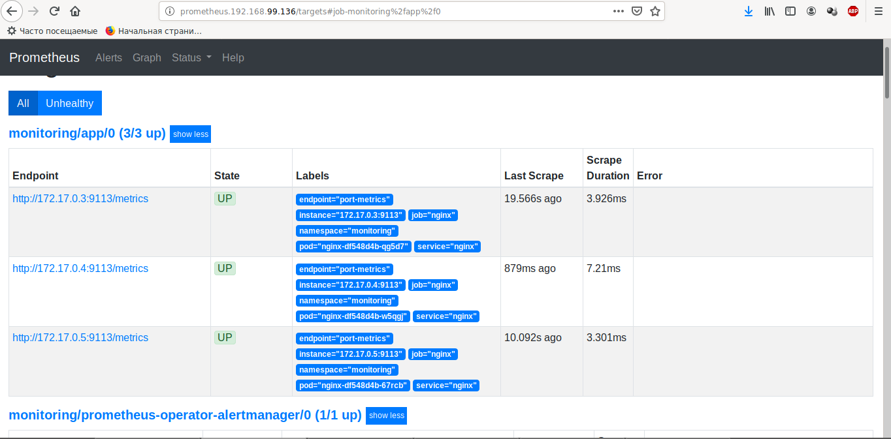

# 8 kubernetes-monitoring

## 1. Создаем namespace
~~~
$ kubectl create ns monitoring
~~~

## 2. Создаем configMap
~~~
$ kubectl apply -f nginx-configMaps.yaml -n monitoring
~~~

        В задании сказано создать свой docker образ. Я считаю это излишним. 
        Главное отличие созданного образа от базового - это изменение конфигурации
        Поэтому я посчитал создание еще одного образа - избыточным. Я создал configMap
        в котором указал измененую конфигурацию и примонтировал ее к базовому образу nginx.

## 3. Создаем деплоймент и запускаем
~~~
$ kubectl apply -f nginx-deployment.yaml -n monitoring
~~~

## 4. Устанавливаем helm

https://helm.sh/docs/intro/install/

~~~
$ wget https://get.helm.sh/helm-v3.2.1-linux-amd64.tar.gz
$ tar -zxvf helm-v3.2.1-linux-amd64.tar.gz
$ sudo mv linux-amd64/helm /usr/local/bin/helm
$ helm version
~~~

## 5. Устанавливаем и запускаем nginx-ingress
        
### 5.1 Устанавливаем nginx-ingress
~~~
$ helm upgrade --install nginx-ingress google-helm/nginx-ingress --namespace=monitoring
~~~

### 5.2 Прописываем ingress.yaml
```
apiVersion: networking.k8s.io/v1beta1
kind: Ingress
metadata:
    name: web
    annotations:
        nginx.ingress.kubernetes.io/rewrite-target: /
spec:
    rules:
        - http:
            paths:
            - path: /web
              backend:
                serviceName: web-svc
                servicePort: 8000
```


### 5.3 Запускаем
```
$ kubectl apply -f ingress.yaml -n monitoring
```

## 6. Запускаем сервис
```
        apiVersion: v1
        kind: Service
        metadata:
            name: nginx
            labels:
                app: nginx
        spec:
            selector:
                app: nginx
            type: ClusterIP
            ports:
                - name: port-http
                protocol: TCP
                port: 8000
                targetPort: 8000
                - name: port-metrics
                protocol: TCP
                port: 9113
                targetPort: 9113
```

```
$ kubectl apply -f nginx-service.yaml -n monitoring
```


## 7. Устанавливаем Prometheus Operator

### 7.1 Добавляем репозиторий
```
$ helm repo add google-helm https://kubernetes-charts.storage.googleapis.com/
$ helm repo update
```

### 7.2 Скачиваем файл values
```
$ helm inspect values stable/prometheus-operator > prometheus-operator.values.yaml
```

```
        alertmanager:
            ingress:
                enabled: true
                annotations:
                kubernetes.io/ingress.class: nginx
                hosts:
                - alertmanager.192.168.99.136
                paths:
                - /

        grafana:
            ingress:
                enabled: true
                annotations:
                kubernetes.io/ingress.class: nginx
                hosts:
                - grafana.192.168.99.136
                paths:
                - /

        prometheus:
            prometheusSpec:
                serviceMonitorSelectorNilUsesHelmValues: false
            ingress:
                enabled: true
                annotations:
                kubernetes.io/ingress.class: nginx
                hosts:
                - prometheus.192.168.99.136
                paths:
                - /
```

### 7.3 Устанавливаем
```
$ helm upgrade --install prometheus-operator google-helm/prometheus-operator --namespace=monitoring -f prometheus-operator.values.yaml
```


## 8. Запускаем
```
        apiVersion: monitoring.coreos.com/v1
        kind: ServiceMonitor
        metadata:
        name: app
        labels:
            app: nginx
        spec:
        selector:
            matchLabels:
            app: nginx
        namespaceSelector:
            any: true
        endpoints:
        - port: metrics
            path: '/metrics'
```

```
$ kubectl apply -f nginx-service-monitor.yaml -n monitoring
```

## 9 Получаем пароль для Grafana
### 9.1 Получаем список секретов

```
        $ kubectl get secret -n monitoring
        NAME                                                       TYPE                                  DATA   AGE
        alertmanager-prometheus-operator-alertmanager              Opaque                                1      10m
        default-token-xf5fj                                        kubernetes.io/service-account-token   3      54m
        nginx-ingress-backend-token-xk5p7                          kubernetes.io/service-account-token   3      46m
        nginx-ingress-token-qz9mb                                  kubernetes.io/service-account-token   3      46m
        prometheus-operator-admission                              Opaque                                3      10m
        prometheus-operator-alertmanager-token-ll5hh               kubernetes.io/service-account-token   3      10m
        prometheus-operator-grafana                                Opaque                                3      10m
        prometheus-operator-grafana-test-token-2sfvx               kubernetes.io/service-account-token   3      10m
        prometheus-operator-grafana-token-p54zh                    kubernetes.io/service-account-token   3      10m
        prometheus-operator-kube-state-metrics-token-4rqkt         kubernetes.io/service-account-token   3      10m
        prometheus-operator-operator-token-gvtlf                   kubernetes.io/service-account-token   3      10m
        prometheus-operator-prometheus-node-exporter-token-vgwzw   kubernetes.io/service-account-token   3      10m
        prometheus-operator-prometheus-token-8ncl2                 kubernetes.io/service-account-token   3      10m
        prometheus-prometheus-operator-prometheus                  Opaque                                1      7m12s
        prometheus-prometheus-operator-prometheus-tls-assets       Opaque                                0      7m11s
        sh.helm.release.v1.nginx-ingress.v1                        helm.sh/release.v1                    1      46m
        sh.helm.release.v1.prometheus-operator.v1                  helm.sh/release.v1                    1      10m
```

### 9.2 Смотрим описание секрета для grafana
```
        $ kubectl get secret -n monitoring prometheus-operator-grafana -o yaml
        apiVersion: v1
        data:
        admin-password: cHJvbS1vcGVyYXRvcg==
        admin-user: YWRtaW4=
        ldap-toml: ""
        kind: Secret
        metadata:
        annotations:
            meta.helm.sh/release-name: prometheus-operator
            meta.helm.sh/release-namespace: monitoring
        creationTimestamp: "2020-05-20T23:09:59Z"
        labels:
            app.kubernetes.io/instance: prometheus-operator
            app.kubernetes.io/managed-by: Helm
            app.kubernetes.io/name: grafana
            app.kubernetes.io/version: 6.7.3
            helm.sh/chart: grafana-5.0.18
        name: prometheus-operator-grafana
        namespace: monitoring
        resourceVersion: "24959"
        selfLink: /api/v1/namespaces/monitoring/secrets/prometheus-operator-grafana
        uid: 045f7868-5543-4c57-a00d-7d63427fd904
        type: Opaque
```

### 9.3 Расшифруем base64
```
$ echo "YWRtaW4=" | base64 -d
  admin

$ echo "cHJvbS1vcGVyYXRvcg==" | base64 -d
  prom-operator

```

## 10. Идем на Prometheus


