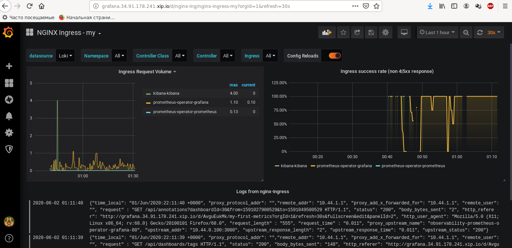

# Домашняя работа 9 kubernetes-logging

## 0 Разворачиваем кластер

### 0.0 Запускаем кластер
```
$ gcloud beta container clusters create "mycluster" \
    --no-enable-basic-auth \
    --machine-type "n1-standard-2" \
    --image-type "COS" \
    --disk-type "pd-standard" \
    --disk-size "100" \
    --num-nodes "1" \
    --no-enable-stackdriver-kubernetes && \
gcloud beta container node-pools create "infra-pool" \
    --cluster "mycluster" \
    --machine-type "n1-standard-2" \
    --image-type "COS" \
    --disk-type "pd-standard" \
    --disk-size "100" \
    --node-taints node-role=infra:NoSchedule \
    --num-nodes "3" 


$ kubectl get nodes
NAME                                       STATUS   ROLES    AGE   VERSION
gke-mycluster-default-pool-893dc543-2785   Ready    <none>   12m   v1.14.10-gke.36
gke-mycluster-infra-pool-c4749539-mc0s     Ready    <none>   11m   v1.14.10-gke.36
gke-mycluster-infra-pool-c4749539-n60k     Ready    <none>   11m   v1.14.10-gke.36
gke-mycluster-infra-pool-c4749539-tx36     Ready    <none>   11m   v1.14.10-gke.36

$ kubectl get node/gke-mycluster-infra-pool-c4749539-mc0s -o yaml | grep -A 15 taint
  taints:
  - effect: NoSchedule
    key: node-role
    value: infra
status:
  addresses:
  - address: 10.164.0.36
    type: InternalIP
  - address: 34.91.201.208
    type: ExternalIP
  - address: gke-mycluster-infra-pool-c4749539-mc0s.europe-west4-a.c.studied-glow-255313.internal
    type: InternalDNS
  - address: gke-mycluster-infra-pool-c4749539-mc0s.europe-west4-a.c.studied-glow-255313.internal
    type: Hostname
  allocatable:
    attachable-volumes-gce-pd: "127"
```

## 0.1 Установка HipsterShop
```
$ kubectl create ns microservices-demo
$ kubectl apply -f https://raw.githubusercontent.com/express42/otus-platform-snippets/master/Module-02/Logging/microservices-demo-without-resources.yaml \
    -n microservices-demo

$ kubectl get pods -n microservices-demo -o wide
NAME                                     READY   STATUS    RESTARTS   AGE    IP           NODE                                       NOMINATED NODE   READINESS GATES
adservice-6898984d4c-kf96d               1/1     Running   0          3m2s   10.44.0.19   gke-mycluster-default-pool-893dc543-2785   <none>           <none>
cartservice-86854d9586-blj76             1/1     Running   2          3m4s   10.44.0.14   gke-mycluster-default-pool-893dc543-2785   <none>           <none>
checkoutservice-85597d98b5-x7zp2         1/1     Running   0          3m6s   10.44.0.9    gke-mycluster-default-pool-893dc543-2785   <none>           <none>
currencyservice-c97fb88c9-lpttn          1/1     Running   0          3m3s   10.44.0.16   gke-mycluster-default-pool-893dc543-2785   <none>           <none>
emailservice-c6958d989-t4wwb             1/1     Running   0          3m6s   10.44.0.8    gke-mycluster-default-pool-893dc543-2785   <none>           <none>
frontend-756f85785-k87c9                 1/1     Running   0          3m5s   10.44.0.11   gke-mycluster-default-pool-893dc543-2785   <none>           <none>
loadgenerator-755dcf9f5d-56ht8           1/1     Running   4          3m3s   10.44.0.15   gke-mycluster-default-pool-893dc543-2785   <none>           <none>
paymentservice-66fbfd9d8f-sm9pj          1/1     Running   0          3m5s   10.44.0.12   gke-mycluster-default-pool-893dc543-2785   <none>           <none>
productcatalogservice-78694d9b67-k4nqh   1/1     Running   0          3m4s   10.44.0.13   gke-mycluster-default-pool-893dc543-2785   <none>           <none>
recommendationservice-948bbf47c-6fpqf    1/1     Running   0          3m5s   10.44.0.10   gke-mycluster-default-pool-893dc543-2785   <none>           <none>
redis-cart-6cf575c898-cbzdj              1/1     Running   0          3m2s   10.44.0.18   gke-mycluster-default-pool-893dc543-2785   <none>           <none>
shippingservice-7fc8b8d49f-wnj8q         1/1     Running   0          3m3s   10.44.0.17   gke-mycluster-default-pool-893dc543-2785   <none>           <none>
```

они все запустились на одной ноде


## 1. Установка  EFK-стека
### 1.0 Добавим репозиторий
```
$ helm3 repo add elastic https://helm.elastic.co
```
### 1.1 Установим компоненты
```
$ kubectl create ns observability && \
  helm3 upgrade --install elasticsearch elastic/elasticsearch --namespace observability && \
  helm3 upgrade --install kibana elastic/kibana --namespace observability && \
  helm3 upgrade --install fluent-bit stable/fluent-bit --namespace observability
```

### 1.2 Переустановка Elastic 
```
$ kubectl get pods -n observability
NAME                            READY   STATUS    RESTARTS   AGE
elasticsearch-master-0          0/1     Running   0          97s
elasticsearch-master-1          0/1     Pending   0          97s
elasticsearch-master-2          0/1     Pending   0          97s
fluent-bit-j5gvp                1/1     Running   0          84s
kibana-kibana-949fcbc99-g7npx   0/1     Pending   0          92s
```

видим что elasticSearch пытался запуститься на одной (все три реплики) но запустился только один
Это связано с параметром tolerations

Создадим файл elasticsearch.values.yaml где укажем что мы можем ставить и на другие ноды
```
tolerations:
  - key: node-role
    operator: Equal
    value: infra
    effect: NoSchedule
```

Чтобы установить пул машин на которых должен запускаться ElasticSearch добавим еще настройку nodeSelector
итого:
```
tolerations:
  - key: node-role
    operator: Equal
    value: infra
    effect: NoSchedule
nodeSelector:
  cloud.google.com/gke-nodepool: infra-pool

```

Переустановим используя этот файл:
```
$ helm3 upgrade --install elasticsearch elastic/elasticsearch --namespace observability\
               -f elasticsearch.values.yaml
```

смотрим
```
$ kubectl get pods -n observability
NAME                            READY   STATUS    RESTARTS   AGE
elasticsearch-master-0          1/1     Running   0          7m35s
elasticsearch-master-1          1/1     Running   0          8m55s
elasticsearch-master-2          1/1     Running   0          10m
fluent-bit-j5gvp                1/1     Running   0          30m
kibana-kibana-949fcbc99-p66kf   1/1     Running   0          14m


$ kubectl get pods -n observability -o wide -l chart=elasticsearch
NAME                     READY   STATUS    RESTARTS   AGE     IP          NODE                                     NOMINATED NODE   READINESS GATES
elasticsearch-master-0   1/1     Running   0          9m21s   10.44.2.3   gke-mycluster-infra-pool-c4749539-tx36   <none>           <none>
elasticsearch-master-1   1/1     Running   0          10m     10.44.3.3   gke-mycluster-infra-pool-c4749539-mc0s   <none>           <none>
elasticsearch-master-2   1/1     Running   0          12m     10.44.1.3   gke-mycluster-infra-pool-c4749539-n60k   <none>           <none>
```

### 1.3 Развернем nginx-controller
```
$ kubectl create ns nginx-ingress
$ helm3 upgrade --install nginx-ingress stable/nginx-ingress --wait \
                --namespace=nginx-ingress \
                -f nginx-ingress.values.yaml

$ kubectl get pods -n nginx-ingress -o wide
NAME                                            READY   STATUS    RESTARTS   AGE     IP           NODE                                       NOMINATED NODE   READINESS GATES
nginx-ingress-controller-86db4468d8-g5zvm       1/1     Running   0          2m29s   10.44.3.4    gke-mycluster-infra-pool-c4749539-mc0s     <none>           <none>
nginx-ingress-controller-86db4468d8-p9kr7       1/1     Running   0          2m28s   10.44.1.4    gke-mycluster-infra-pool-c4749539-n60k     <none>           <none>
nginx-ingress-controller-86db4468d8-xs69f       1/1     Running   0          2m28s   10.44.2.4    gke-mycluster-infra-pool-c4749539-tx36     <none>           <none>
nginx-ingress-default-backend-7db6cc5bf-n9p7x   1/1     Running   0          2m29s   10.44.0.24   gke-mycluster-default-pool-893dc543-2785   <none>           <none>
```

### 1.4 Установим Kibana
```
$ kubectl get svc -A
...
nginx-ingress        nginx-ingress-controller        LoadBalancer   10.47.246.228   34.91.178.241   80:32750/TCP,443:32076/TCP   6m26s
...

$ helm3 upgrade --install kibana elastic/kibana --namespace observability -f kibana.values.yaml
```

### 1.5 Откроем Kibana в браузере и увидим что ему не хватает настроек ElasticSearch


### 1.6 Смотрим логи fluent-a
```
$ kubectl get pods -n observability
NAME                            READY   STATUS    RESTARTS   AGE
elasticsearch-master-0          1/1     Running   0          31m
elasticsearch-master-1          1/1     Running   0          32m
elasticsearch-master-2          1/1     Running   0          33m
fluent-bit-j5gvp                1/1     Running   0          53m
kibana-kibana-949fcbc99-p66kf   1/1     Running   0          37m

$ kubectl logs fluent-bit-j5gvp -n observability --tail 3
[2020/06/01 12:58:00] [ warn] net_tcp_fd_connect: getaddrinfo(host='fluentd'): Name or service not known
[2020/06/01 12:58:00] [error] [out_fw] no upstream connections available
[2020/06/01 12:58:00] [ warn] [engine] failed to flush chunk '1-1591013039.43886159.flb', retry in 1833 seconds: task_id=13, input=tail.0 > output=forward.0
```

### 1.7 Создаем файл fluent-bit.values.yaml 
учтем настройку elasticSearch и плагин Modify
```
backend:
  type: es
  es:
    host: elasticsearch-master
rawConfig: |
    @INCLUDE fluent-bit-service.conf
    @INCLUDE fluent-bit-input.conf
    @INCLUDE fluent-bit-filter.conf
    @INCLUDE fluent-bit-output.conf

    [FILTER]
    Name    modify
    Match   *
    Remove  time
    Remove  @timestamp
```

```
$ helm3 upgrade --install fluent-bit stable/fluent-bit --namespace observability\
               -f fluent-bit.values.yaml
```


## 2. Мониторинг ElasticSearch

### 2.1 Установка Prometheus
```
$ helm3 upgrade --install prometheus-operator stable/prometheus-operator\
               --version=8.5.14 --namespace=observability -f prometheus-operator.values.yaml
```

Установим Prometheus exporter
```
$ helm3 upgrade --install elasticsearch-exporter stable/elasticsearch-exporter \
                --set es.uri=http://elasticsearch-master:9200 \
                --set serviceMonitor.enabled=true \
                --namespace=observability
```

### 2.2 Импортируем дашбоард в графану
дашбоард: https://grafana.com/grafana/dashboards/4358 


### 2.3 Выключаем 1 ноду
```
$ $ kubectl get nodes
NAME                                       STATUS   ROLES    AGE     VERSION
gke-mycluster-default-pool-893dc543-2785   Ready    <none>   3h41m   v1.14.10-gke.36
gke-mycluster-infra-pool-c4749539-mc0s     Ready    <none>   3h40m   v1.14.10-gke.36
gke-mycluster-infra-pool-c4749539-n60k     Ready    <none>   3h40m   v1.14.10-gke.36
gke-mycluster-infra-pool-c4749539-tx36     Ready    <none>   3h40m   v1.14.10-gke.36

$ kubectl drain gke-mycluster-infra-pool-c4749539-mc0s --ignore-daemonsets

$ kubectl get nodes
NAME                                       STATUS                     ROLES    AGE     VERSION
gke-mycluster-default-pool-893dc543-2785   Ready                      <none>   3h42m   v1.14.10-gke.36
gke-mycluster-infra-pool-c4749539-mc0s     Ready,SchedulingDisabled   <none>   3h41m   v1.14.10-gke.36
gke-mycluster-infra-pool-c4749539-n60k     Ready                      <none>   3h41m   v1.14.10-gke.36
gke-mycluster-infra-pool-c4749539-tx36     Ready                      <none>   3h41m   v1.14.10-gke.36
```


## 2.4 Уроним еще одну ноду
```
$ kubectl drain gke-mycluster-infra-pool-c4749539-n60k --ignore-daemonsets
(она не сможет перераспределить elastic search но ноду пометит как SchedulingDisabled)

$ kubectl delete pod/elasticsearch-master-2 -n observability

$ kubectl get pods -n observability 
NAME                                                      READY   STATUS    RESTARTS   AGE
...
elasticsearch-master-0                                    1/1     Running   0          168m
elasticsearch-master-1                                    0/1     Pending   0          9m14s
elasticsearch-master-2                                    0/1     Pending   0          22s

$ kubectl get nodes
NAME                                       STATUS                     ROLES    AGE     VERSION
gke-mycluster-default-pool-893dc543-2785   Ready                      <none>   3h54m   v1.14.10-gke.36
gke-mycluster-infra-pool-c4749539-mc0s     Ready,SchedulingDisabled   <none>   3h54m   v1.14.10-gke.36
gke-mycluster-infra-pool-c4749539-n60k     Ready,SchedulingDisabled   <none>   3h54m   v1.14.10-gke.36
gke-mycluster-infra-pool-c4749539-tx36     Ready                      <none>   3h54m   v1.14.10-gke.36
```


### 2.5 Возвращаем ноды в работу
```
$ kubectl uncordon gke-mycluster-infra-pool-c4749539-n60k
$ kubectl uncordon gke-mycluster-infra-pool-c4749539-mc0s
```


## 3 nginx-ingress
Чтобы появились логи поменяем fluentbit.values.yaml и nginx-ingress.values.yaml
```
$ helm3 upgrade --install fluent-bit stable/fluent-bit --namespace observability\
               -f fluent-bit.values.yaml && \
  helm3 upgrade --install nginx-ingress stable/nginx-ingress --wait \
                --namespace=nginx-ingress \
                -f nginx-ingress.values.yaml
```
получим


### 3.1  Создадим дашбоард
(kubernetes.labels.app : nginx-ingress and status < 500 and status >= 400)


## 4. Loki

### 4.1 Установка
```
$ helm3 repo add loki https://grafana.github.io/loki/charts
$ helm3 repo update
$ helm3 upgrade --install loki loki/loki-stack --namespace=observability -f loki.values.yml
$ helm3 upgrade --install prometheus-operator stable/prometheus-operator --version=8.5.14 \
                --namespace=observability -f prometheus-operator.values.yaml
```

### 4.2 Grafana
Откроем Графану и посмотрим логи от Loki


### 4.3 Cоздадим свой дашборд


